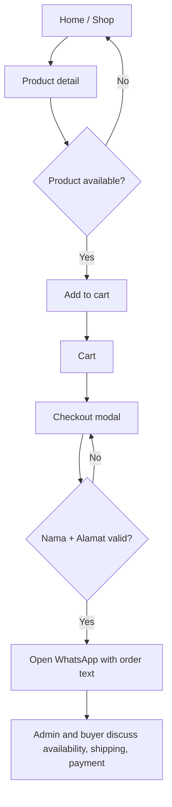
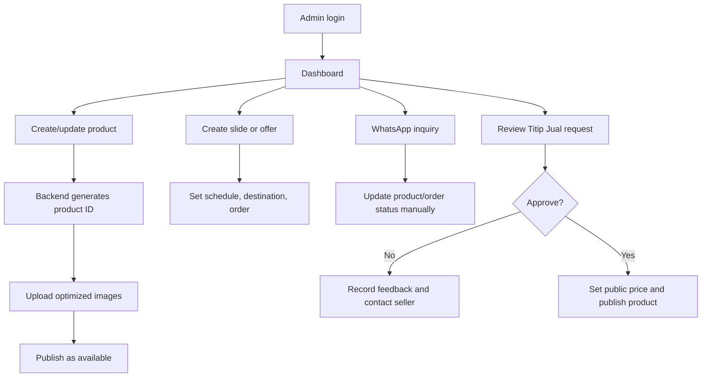
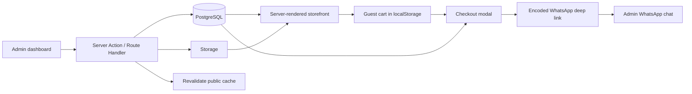

# PRD — Preloved Store

**Status:** Ready for implementation  
**Product type:** Lightweight mobile-first e-commerce for individual/small-scale preloved sellers  
**Primary conversion:** Product discovery → cart → two-field checkout modal → WhatsApp conversation with seller

---

## 1. Product definition

Preloved Store is a fast, image-led storefront for unique second-hand items. It does **not** use a payment gateway or expose a complicated shipment flow. A buyer adds available items to a cart, enters only a preferred name and a brief address/location, and is redirected to a prefilled WhatsApp chat with the store admin. Availability, shipping cost, payment, and final confirmation are negotiated in WhatsApp.

In addition to the store owner's catalogue, the platform accepts **Titip Jual** submissions from the public. A prospective seller submits an item without creating an account. The admin curates the request, accepts or rejects it, determines the public selling price after considering the seller's requested net payout, and publishes accepted items as regular catalogue products.

The product must feel curated and personal—not like a generic marketplace template. Its visual character is warm, clean, slightly editorial, and trustworthy. The application must remain performant on average Indonesian mobile connections.

### Goals

- Make a small preloved catalogue easy to browse and purchase.
- Keep checkout friction deliberately low: only **Nama** and **Alamat** are required.
- Give the seller full control over products, featured content, slides, and offers.
- Give every item a stable human-readable product ID for WhatsApp confirmation.
- Avoid unnecessary operational complexity: no payment gateway, courier API, user account, or buyer order portal in v1.
- Let prospective sellers submit curated consignment requests without registration.

### Non-goals (v1)

- Buyer/seller registration/login, checkout payment, online invoice, reviews, wishlist, live inventory reservation, open multi-vendor self-service, courier-rate API, or automated WhatsApp sending.
- A feature cannot be added merely because conventional e-commerce sites have it. It must support the conversion flow above.

---

## 2. Users, roles, and success criteria

### Buyer

Typically a mobile visitor looking for a distinct single-stock item. They need clear condition information, good photos, price clarity, and a very short path to contact the seller.

### Admin

The store owner/operator. They manage products, promotions, and manually update status after WhatsApp discussions.

### Success metrics

- Product pages and first homepage image load quickly on mobile; target LCP ≤ 2.5 s on a realistic 4G test.
- Checkout modal completion → WhatsApp redirect rate.
- Zero duplicate visible Product IDs.
- A product marked `sold` or `reserved` cannot be newly added to cart.
- Admin can publish a product or slide without developer assistance.

---

## 3. Scope and functional requirements

### 3.1 Buyer-facing storefront

| Feature | Requirement |
|---|---|
| Home | Shows active highlighted slides, featured products, latest products, active offers, and short “How it works”. |
| Shop | Product grid with search, category filtering, sort by newest/price, and status-aware cards. |
| Product detail | Gallery, Product ID, name, price, condition, short description, full description, availability and add-to-cart action. |
| Cart | Persistent guest cart, editable item quantity only where product stock supports it; subtotal; product IDs visible. |
| Checkout modal | Opens from cart. Required fields: `Nama` and `Alamat`. No phone field, shipping choice, payment method, or notes. |
| WhatsApp handoff | Valid form opens `https://wa.me/<ADMIN_NUMBER>?text=<ENCODED_MESSAGE>` in a new tab/app intent. Cart stays intact until the user returns; clear it only after confirmed outbound handoff succeeds in the browser. |
| Offers | Dedicated page for active promotions. Offers may have a promo price and validity period. |
| Highlighted products | Dedicated collection page and home section for manually featured items. |
| Information | Simple About / How to order page: availability, shipping, payment, and final confirmation occur through WhatsApp. |

### 3.2 Admin dashboard

| Area | Requirement |
|---|---|
| Authentication | Admin-only login; no public registration. |
| Overview | Counts for available, reserved, sold products; active slides/offers; simple sales/order figures if orders are manually logged. |
| Products | Create, edit, archive/delete, search, filter, upload/reorder images, set condition, price, status, category, featured flag. |
| Product ID | Generated by the backend only. Never editable after creation. Format `PLV-0001`, monotonically increasing. |
| Slides | Create/edit/delete; image, eyebrow, title, short body, CTA label, internal destination, display order, active toggle, optional date window. |
| Offers | Create/edit/delete; title, summary, banner optional, linked product(s), promo price or percentage, period, active state. |
| Categories | Name, slug, optional description, sort order, active state. |
| Settings | Store name, WhatsApp number in E.164 digits only, social links, address/operating note. |
| Manual orders (optional but recommended) | Record a WhatsApp order and status (`inquiry`, `confirmed`, `shipped`, `completed`, `cancelled`) for dashboard reporting. This is not required for buyer checkout. |
| Titip Jual requests | Review incoming seller submissions, contact seller, approve/reject with feedback, set selling price, and convert an approved request into a product. |

### 3.3 Titip Jual (loginless consignment)

The public route `/titip-jual` is a request form, not a self-publishing interface. A submission has no buyer/seller account and never appears publicly until an admin approves and publishes it.

**Required public form fields**

- Nama
- Nomor WhatsApp (primary communication channel)
- Email (optional fallback)
- Nama produk
- Kategori
- Kondisi barang
- Deskripsi dan kekurangan/cacat barang
- Harga titip bersih (integer IDR)
- At least one photo; maximum six photos
- Required consent to Syarat Titip Jual and privacy notice

Use the field label **`Harga yang ingin diterima`** with helper text: `Nominal yang Anda harapkan diterima setelah barang terjual. Harga jual di website ditentukan setelah proses kurasi.` Do **not** label it `harga modal`, because it is ambiguous.

**Admin review actions**

- `Minta informasi tambahan`: admin contacts the seller through WhatsApp; request stays under review.
- `Tolak`: admin enters a concise feedback message. The admin then copies/sends this through WhatsApp or email; v1 does not promise automated delivery.
- `Setujui`: admin records the proposed public selling price, optional internal margin, and publication decision.
- `Publikasikan`: approved information is copied into a normal product record; the visible Product ID is created only at this point.

The admin must be able to edit the public product title, description, condition labels, photo ordering, category, and price before publication. The submitter's requested net payout and internal margin are never public.

### 3.4 Consignment request states

`pending` → `reviewing` → `approved` → `published` → `sold` → `settled` is the normal path. `rejected` may be entered from `pending` or `reviewing`; `withdrawn` is available when the seller cancels before publication.

- `pending`: submitted, awaiting triage.
- `reviewing`: admin is evaluating the item or awaiting additional information.
- `approved`: item accepted, but not yet public.
- `published`: a linked product is live in the catalogue.
- `rejected`: declined with an internal feedback note.
- `sold`: linked product is sold.
- `settled`: seller payout has been completed manually.
- `withdrawn`: seller or admin removed the request before publication.

### 3.5 Product states

`available` → `reserved` → `sold` is the normal path. Admin may return `reserved` to `available`. `archived` hides a product from public pages.

- `available`: visible, purchasable, add-to-cart enabled.
- `reserved`: visible with “Sedang dipesan”; add-to-cart disabled.
- `sold`: visible only if desired for portfolio/history; clearly sold and non-purchasable. Default: excluded from Shop.
- `archived`: never public.

---

## 4. Information architecture and page flow

### Public routes

| Route | Page purpose |
|---|---|
| `/` | Home |
| `/shop` | Browse/search/filter catalogue |
| `/products/[slug]` | Product detail |
| `/highlighted` | All featured products |
| `/offers` | Active offers |
| `/cart` | Shopping cart |
| `/how-it-works` | Ordering explanation and contact |
| `/titip-jual` | Loginless consignment request form |
| `/syarat-titip-jual` | Consignment terms, commission/margin rules, acceptable condition, shipping, payout, and time limits |

### Admin routes

| Route | Page purpose |
|---|---|
| `/admin/login` | Login |
| `/admin` | Dashboard overview |
| `/admin/products` | Product list |
| `/admin/products/new` | New product form |
| `/admin/products/[id]` | Edit product |
| `/admin/slides` | Highlighted slide manager |
| `/admin/offers` | Offer manager |
| `/admin/categories` | Category manager |
| `/admin/orders` | Optional manual WhatsApp order log |
| `/admin/settings` | Store settings |
| `/admin/consignments` | Titip Jual submission list and review queue |
| `/admin/consignments/[id]` | Request review, seller contact details, feedback, pricing, and conversion to product |

### Buyer flow



### Admin flow



---

## 5. Checkout and WhatsApp specification

### Modal copy and behavior

- Title: `Lanjutkan Pesanan`
- Supporting text: `Masukkan informasi singkat agar admin dapat mengonfirmasi pesananmu.`
- Fields: 
  - `Nama` — text, required, 2–60 characters.
  - `Alamat` — text area, required, 5–300 characters. This may be a city, district, or full address; do not label it “alamat lengkap”.
- Primary CTA: `Pesan via WhatsApp`
- Secondary CTA: `Batal`
- Close icon and Escape key close modal without clearing cart.
- Inline validation appears directly below the invalid field. Do not use intrusive alerts.

### WhatsApp message template

```text
Halo Kak, saya ingin memesan barang berikut.

Nama: {buyer_name}
Alamat: {buyer_address}

Pesanan:
1. [{product_id}] {product_name} — {formatted_price}
2. [{product_id}] {product_name} — {formatted_price}

Total: {formatted_subtotal}

Mohon informasi ketersediaan barang, ongkir, dan metode pembayarannya. Terima kasih.
```

Rules:

- Use the active WhatsApp number from store settings, e.g. `62812xxxxxxx`; never hard-code it in the client.
- Escape/encode the complete message with `encodeURIComponent`.
- Re-check item status immediately before producing the message. If an item is no longer available, show which item changed and retain the rest of the cart.
- In v1, do not claim that an order is confirmed merely because WhatsApp opened.

---

## 6. UX and visual direction

### Design principles

1. **Curated, not crowded.** One strong image and readable product facts beat excessive badges and controls.
2. **Warm trust.** Preloved items need condition transparency; surface condition, Product ID, price, and status early.
3. **Quiet motion.** Use brief fades and small translate transitions (150–220 ms). No bouncing, floating blobs, excessive gradients, parallax, or autoplay video.
4. **Mobile first.** The main actions remain comfortably reachable and obvious at 360 px width.
5. **Direct language.** Use Bahasa Indonesia; friendly but short. Do not use filler marketing copy or fake scarcity.

### Colour system

| Token | Hex | Use |
|---|---:|---|
| `ink` | `#26364A` | Primary text, navigation, deep blue contrast |
| `blue-pastel` | `#B9D8F2` | Primary accents, info surfaces |
| `blue-soft` | `#EAF5FF` | Subtle blue background |
| `pink-pastel` | `#F4BED0` | Secondary accents, featured highlight |
| `pink-soft` | `#FFF0F5` | Soft pink panels |
| `cream` | `#FFF9F2` | Main page background |
| `peach` | `#F6D6B8` | Offer accent only |
| `sage` | `#C9DEC9` | Available/status accent |
| `line` | `#E8E1DB` | Borders/dividers |
| `muted` | `#6D7480` | Secondary text |
| `danger` | `#B9475A` | Errors/destructive action |

Use cream as the page canvas, not pure white. Keep coloured surfaces sparse. Pink and blue should never both fill the same component unless one is a small accent.

### Typography and layout

- Use one clean sans-serif family such as **Plus Jakarta Sans** or **Manrope**. Load only needed weights: 400, 500, 600, 700.
- Headline tracking slightly tight; body line height ~1.5.
- Content max width: 1200 px. Horizontal padding: 16 px mobile, 24 px tablet, 40 px desktop.
- Cards: 12–16 px radius, 1 px `line` border, almost no shadow. Use shadow only for modal and sticky cart action.
- Product grids: 2 columns mobile, 3 tablet, 4 desktop. Preserve consistent image aspect ratio (4:5 recommended).

### Home composition

1. Compact header: wordmark, Shop, Offers, Cart badge; hamburger on mobile.
2. Highlighted slide carousel: 3–5 active slides maximum; first slide visible server-side; dots + explicit previous/next controls; pause auto-rotation after interaction. Use a static 4:5 crop on mobile and 16:7 on desktop only if source images support it.
3. Featured products section with an understated `Lihat semua` link.
4. Latest products.
5. Active offers, only when at least one offer exists.
6. Three-step “Cara pesan” strip: Pilih barang → Isi nama & alamat → Lanjut WhatsApp.
7. Small footer.

Add a visible but secondary navigation/footer link, `Titip Jual`, rather than placing it as the primary home-page CTA. This keeps the main buyer journey focused while making seller intake discoverable.

### Anti-generic requirements

- Do not use giant hero text, abstract gradient blobs, generic “Shop now” language everywhere, testimonial carousels, fake reviews, or dashboard-style statistics on the public home page.
- Do not create every section inside a large rounded rectangle. Use whitespace, short rules, and occasional soft panels.
- Use real product images prominently. Placeholder images should be neutral editorial placeholders only during development.
- CTA labels must be contextual: `Lihat barang`, `Tambah ke keranjang`, `Pesan via WhatsApp`, not repeated vague variants.
- The admin interface may be utilitarian and denser than the storefront; it should not imitate the public pastel presentation.

---

## 7. Front-end architecture

### Recommended stack

- **Next.js (App Router) + TypeScript**: server-rendered public catalogue for speed and SEO.
- **Tailwind CSS** with design tokens above, plus a small component layer (do not install a full visual kit unless required).
- **Supabase JS** for database/auth/storage.
- **Zod + React Hook Form** for admin and checkout validation.
- **Lucide** for a limited set of coherent icons.

### Rendering strategy

- Public homepage/shop/product pages: Server Components and cached data fetches. Revalidate public catalogue after product/slide/offer changes.
- Cart and checkout modal: Client Components only; cart persisted in `localStorage` with a versioned schema.
- Admin routes: authenticated Server Components where possible; client-side only for image ordering, form interactions, and drag-and-drop.
- Use `next/image`, responsive `sizes`, AVIF/WebP, lazy loading below the fold, and explicit image dimensions to prevent layout shift.

### Component map

```text
app/
  (store)/page.tsx
  (store)/shop/page.tsx
  (store)/products/[slug]/page.tsx
  (store)/highlighted/page.tsx
  (store)/offers/page.tsx
  (store)/cart/page.tsx
  admin/...
components/
  storefront/Header, ProductCard, ProductGrid, ProductGallery
  storefront/HighlightedCarousel, OfferCard, HowItWorks
  cart/CartDrawerOrPage, CheckoutModal, WhatsAppCheckout
  admin/ProductForm, ImageUploader, SlideForm, OfferForm, DataTable
lib/
  supabase, money, whatsapp, validation, product-id, queries
```

### Accessibility and quality

- All interactive elements keyboard reachable; modal traps focus and returns focus to trigger on close.
- Use semantic buttons/links, visible focus ring, alt text required for product images, and sufficient text contrast against pastel backgrounds.
- Respect `prefers-reduced-motion`.
- Empty states must be intentional: `Belum ada produk di kategori ini.`
- Loading states use restrained skeletons that match final layouts; no spinner-only full pages.

---

## 8. Backend architecture

### Recommended stack

- **Supabase PostgreSQL**: relational data and row-level security.
- **Supabase Auth**: admin authentication; admin accounts provisioned manually.
- **Supabase Storage**: product, slide, and offer images.
- **Next.js Route Handlers / Server Actions**: privileged admin mutations, validation, cache invalidation, and safe ID generation.

### Security model

- Public users may read only public, active content and available/publicly-visible products.
- Anonymous users cannot insert, update, or delete database records.
- Only authenticated users with `profiles.role = 'admin'` may mutate store data and upload assets.
- Never expose Supabase service-role credentials to the browser.
- Validate every mutation server-side using Zod; enforce image MIME type and file-size limits.
- Use signed uploads or authenticated storage policies. Public image delivery may use a public bucket only for sanitized display assets.

### Core server responsibilities

1. Generate Product ID transactionally.
2. Create/update product and image records.
3. Enforce status transition rules.
4. Create/update slides and offers; only one scheduled/active query is exposed publicly.
5. Fetch runtime store settings for WhatsApp handoff.
6. Revalidate public pages after admin publication changes.
7. Optionally create a lightweight `order_inquiries` record when WhatsApp checkout starts; this must not imply confirmation.

---

## 9. Data model

Use UUID primary keys internally; use `product_code` as the visible Product ID. Store monetary values as integer IDR (e.g. `85000`), never float.

### `profiles`

| Column | Type | Notes |
|---|---|---|
| `id` | uuid PK | References auth user |
| `role` | enum | `admin` only in v1 |
| `display_name` | text | Optional |
| `created_at` | timestamptz | Default now |

### `categories`

| Column | Type | Notes |
|---|---|---|
| `id` | uuid PK | |
| `name` | text | Unique |
| `slug` | text | Unique, URL-safe |
| `description` | text | Nullable |
| `sort_order` | integer | Default 0 |
| `is_active` | boolean | Default true |

### `products`

| Column | Type | Notes |
|---|---|---|
| `id` | uuid PK | Internal ID |
| `product_code` | text unique | Backend-generated: `PLV-0001` |
| `slug` | text unique | URL-safe title + short suffix |
| `name` | text | Required |
| `category_id` | uuid FK | Nullable only for uncategorized draft |
| `price_idr` | integer | Required, ≥ 0 |
| `description_short` | text | Required, max 180 chars |
| `description` | text | Required |
| `condition` | enum | `like_new`, `very_good`, `good`, `fair` |
| `status` | enum | `draft`, `available`, `reserved`, `sold`, `archived` |
| `is_highlighted` | boolean | Default false |
| `published_at` | timestamptz | Nullable |
| `created_at`, `updated_at` | timestamptz | |

### `product_images`

| Column | Type | Notes |
|---|---|---|
| `id` | uuid PK | |
| `product_id` | uuid FK | Cascade delete |
| `storage_path` | text | Required |
| `alt_text` | text | Required |
| `sort_order` | integer | Required |
| `width`, `height` | integer | Optional metadata |

### `highlight_slides`

| Column | Type | Notes |
|---|---|---|
| `id` | uuid PK | |
| `image_path` | text | Required |
| `eyebrow`, `title`, `body` | text | `title` required; body short |
| `cta_label` | text | Required |
| `cta_type` | enum | `product`, `category`, `offers`, `shop`, `url` |
| `cta_target` | text | Required |
| `sort_order` | integer | Required |
| `is_active` | boolean | Default true |
| `starts_at`, `ends_at` | timestamptz | Nullable |

### `offers` and `offer_products`

`offers`: title, summary, banner_path nullable, `discount_type` (`fixed_price` / `percentage`), amount, start/end time, active flag.  
`offer_products`: offer ID, product ID, optional override promo price. A product can appear in historical offers, but only one active price override may apply at a time.

### `store_settings`

Singleton settings row: `store_name`, `whatsapp_number`, `instagram_url`, `contact_note`, `updated_at`.

### `consignment_requests`

| Column | Type | Notes |
|---|---|---|
| `id` | uuid PK | Internal request ID; never exposed as a public product ID |
| `seller_name` | text | Required |
| `seller_whatsapp` | text | Required; normalize to E.164 digits where possible |
| `seller_email` | text | Nullable |
| `product_name` | text | Seller-submitted title |
| `category_id` | uuid FK | Nullable during intake |
| `condition` | enum | Same controlled values as product condition |
| `description` | text | Required; includes known flaws |
| `requested_net_price_idr` | integer | Seller's requested net payout; private |
| `status` | enum | `pending`, `reviewing`, `approved`, `published`, `rejected`, `withdrawn`, `sold`, `settled` |
| `admin_feedback` | text | Private template/copy for rejection or update |
| `proposed_sale_price_idr` | integer | Private until product publication |
| `internal_margin_idr` | integer | Private; may be derived rather than stored |
| `published_product_id` | uuid FK | Nullable; set when converted |
| `reviewed_by` | uuid FK | Nullable profile ID |
| `reviewed_at`, `created_at`, `updated_at` | timestamptz | |

### `consignment_request_images`

`id`, `request_id`, `storage_path`, `sort_order`, `created_at`. Image uploads must be visible only to admins until a copied product image is published.

### Optional `order_inquiries`

UUID, buyer_name, buyer_address, subtotal_idr, status, created_at. Keep this data minimal and set a retention rule. Its only purpose is internal visibility; WhatsApp remains the source of truth.

---

## 10. Data flow



### Important flows

**Product publication**

1. Admin submits form and images.
2. Server validates text/price/status and uploads images.
3. Database transaction creates product, generates unique `product_code`, and saves image ordering.
4. Public caches for home/shop/product are revalidated.

**Storefront browse**

1. Server fetches only public active products, active slides, and currently valid offers.
2. Product image URLs are optimized by Next/Image.
3. Buyer actions update only local cart state until checkout.

**WhatsApp checkout**

1. Buyer opens checkout modal from cart.
2. Client validates `Nama` and `Alamat`.
3. A lightweight server endpoint verifies current product statuses/prices and returns normalized order lines plus active WhatsApp number.
4. Client constructs the WhatsApp deep link and opens it.
5. Admin manually confirms, reserves, or sells the product.

This revalidation protects against stale carts without building an over-engineered ordering system.

**Titip Jual intake and review**

1. Visitor submits the public request form and image files without logging in.
2. Server validates contact information, text, price, image type/size, and consent before saving the request as `pending`.
3. Admin reviews privately, contacts the submitter if necessary, and records an outcome plus feedback.
4. For an approval, admin sets the proposed public price and converts/copies the curated request into a standard product. The backend generates the Product ID only for the published product.
5. For rejection, admin sees a ready-to-copy feedback message with the seller contact. Sending is manual in v1, through WhatsApp or email.

---

## 11. Performance requirements

- No video hero, third-party chat widget, tracking-heavy scripts, or client-side product catalogue fetch on initial load.
- Max 5 active slides; load first slide eager, later slides lazy.
- Product list pagination or incremental “Load more” after 24 items; do not render an unbounded catalogue.
- Limit product image uploads: 8 images/product, 5 MB/source image maximum; create responsive display sizes.
- Font strategy: self-host/subset where feasible; no more than one family.
- Target Lighthouse mobile: Performance ≥ 90, Accessibility ≥ 95, Best Practices ≥ 95 for representative public routes.

---

## 12. Acceptance criteria

### Checkout

- [ ] Buyer can add multiple available products to a guest cart.
- [ ] Clicking Checkout opens a modal with exactly Nama and Alamat as input fields.
- [ ] Empty/invalid values block submission with inline feedback.
- [ ] A valid form opens WhatsApp with Product ID, product name, price, subtotal, name, and address.
- [ ] No buyer phone number, payment, shipping method, or notes are requested.
- [ ] Reserved/sold items cannot be added or submitted.

### Admin

- [ ] Admin can upload, reorder, replace, and remove product images.
- [ ] Admin can write product name, short description, full description, category, price, condition, and status.
- [ ] Product ID is generated uniquely and cannot be edited.
- [ ] Admin can manage highlighted slides, slide order, target, scheduling, and active state.
- [ ] Admin can manage highlighted products and offers.
- [ ] A visitor can submit a Titip Jual request without creating an account.
- [ ] The public Titip Jual form requires WhatsApp contact, product details, requested net payout, photos, and terms consent.
- [ ] Submitted Titip Jual images and private payout data are not publicly readable.
- [ ] Admin can review, request information, approve, reject with feedback, or withdraw a request.
- [ ] Admin can convert an approved request into a product after setting the public sale price.
- [ ] The public Product ID is generated only when the product is created/published, not when a request is submitted.
- [ ] Public pages update after admin changes without a manual deployment.

### Quality

- [ ] Home is usable at 360 px width without horizontal scrolling.
- [ ] All public and admin write operations are authorization-protected.
- [ ] Pastel colors retain accessible contrast for text and buttons.
- [ ] Page output matches the visual direction and anti-generic requirements in Section 6.

---

## 13. Build order

1. Project setup, tokens, Supabase schema/RLS, admin authentication.
2. Product/category CRUD + image storage + Product ID generator.
3. Server-rendered Home, Shop, Detail, Product card/grid.
4. Guest cart + checkout modal + server-side checkout validation + WhatsApp handoff.
5. Highlighted slides and highlighted products.
6. Offers and promo-price rendering.
7. Loginless Titip Jual form, request storage, secure private image handling, and admin review/conversion flow.
8. Admin dashboard metrics and optional manual inquiry logging.
9. Responsive/accessibility/performance QA, empty/error states, seed content.

---

## 14. Implementation guardrails for Codex

- Implement the PRD as specified; ask before adding features outside its scope.
- Use TypeScript strictly and keep database access in dedicated query/action modules.
- Avoid mock business logic once Supabase is connected. Seed data is allowed only for local development and must be clearly removable.
- Never use stock e-commerce copy, fake reviews, fake discounts, or fabricated inventory.
- Treat Titip Jual submissions as private operational data. Do not expose seller contact details, requested net payout, margin, review notes, or unapproved photos to public routes.
- Do not build seller accounts or allow direct publishing in v1; all catalogue entries pass through admin curation.
- Keep all buyer-facing strings in a central Indonesian dictionary/module to make later editing easy.
- Before finalizing, verify: lint, typecheck, build, responsive mobile layout, form validation, product status guard, and WhatsApp URL output.
